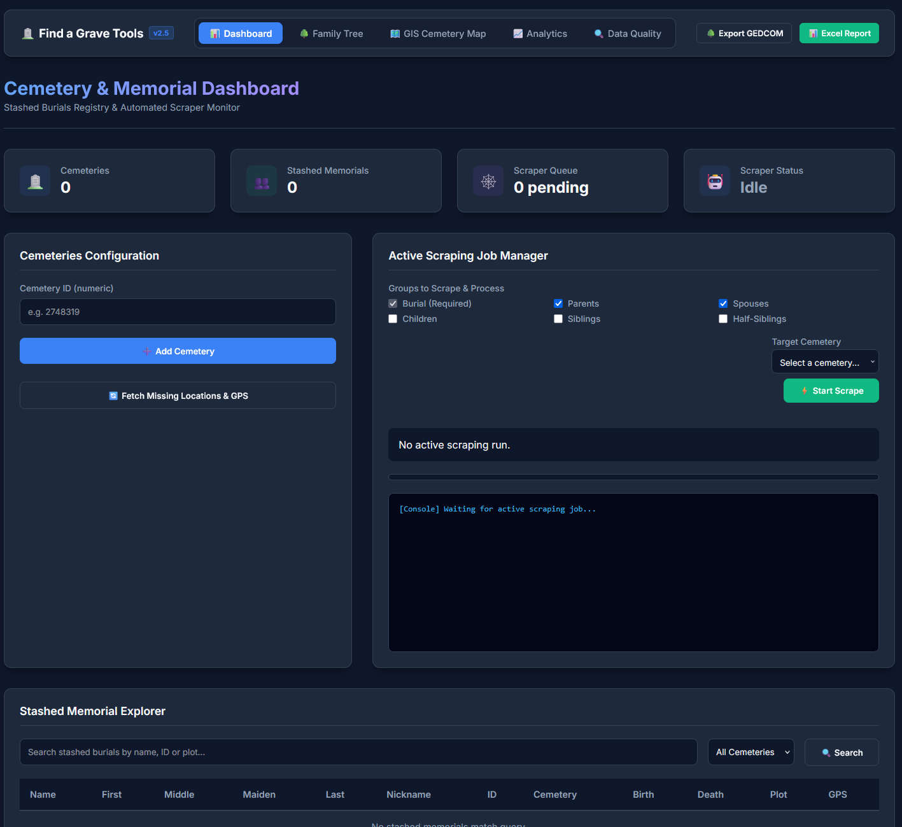
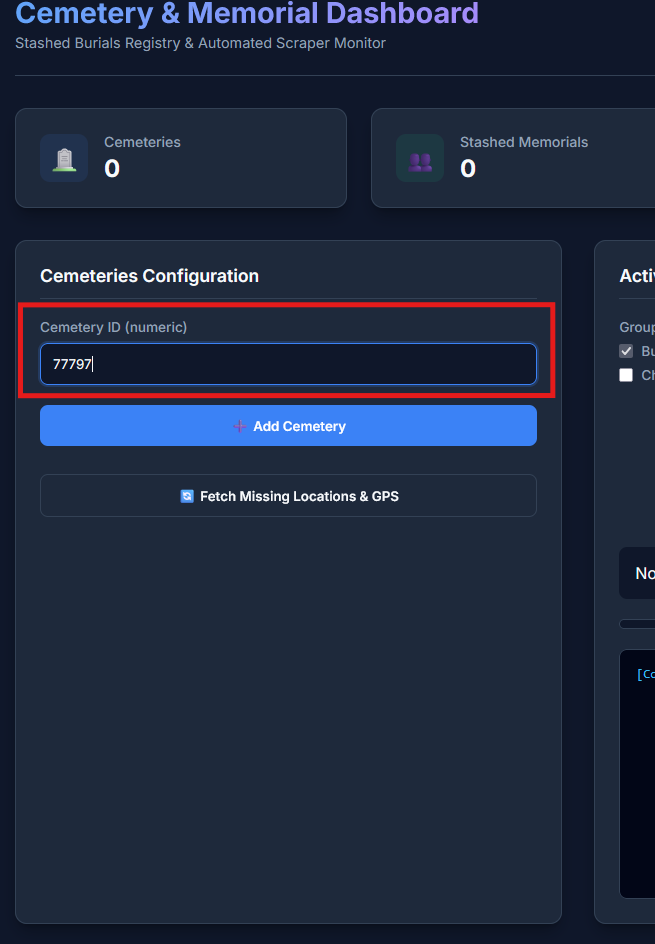
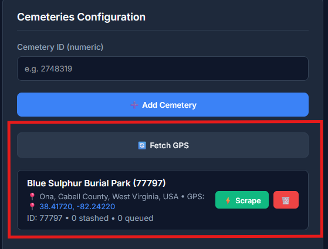
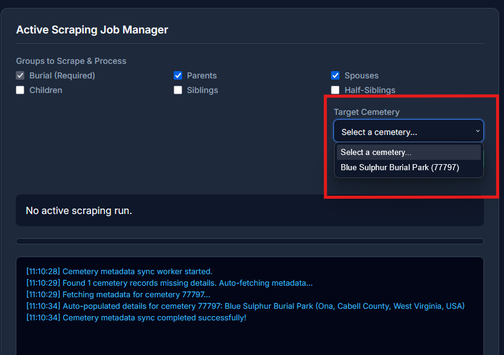
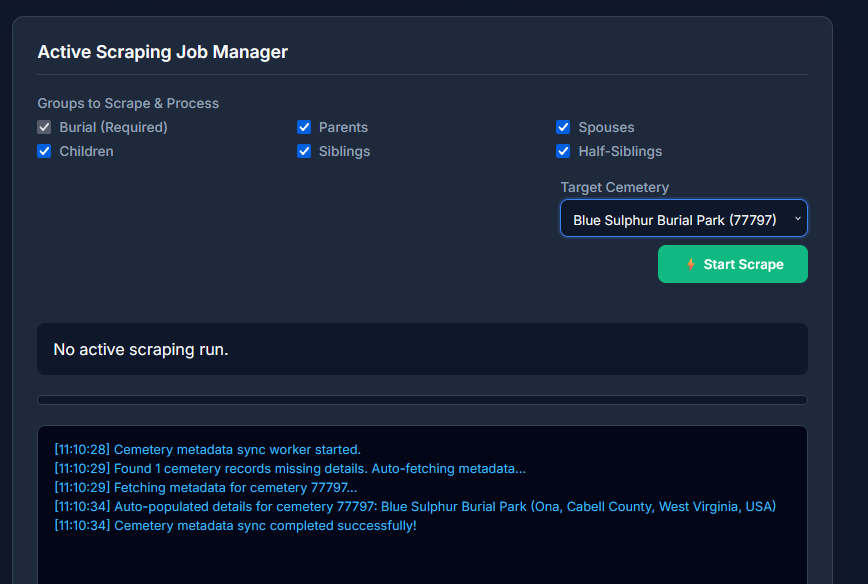
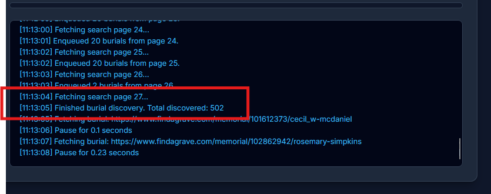
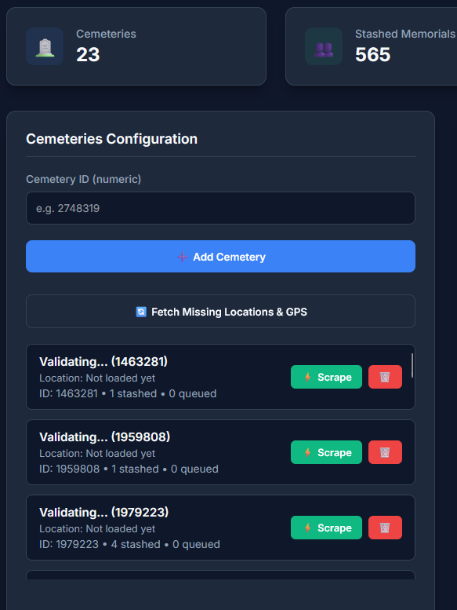
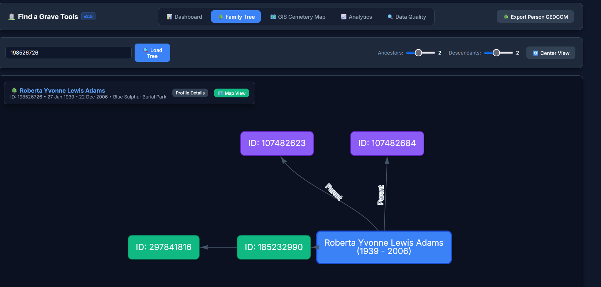
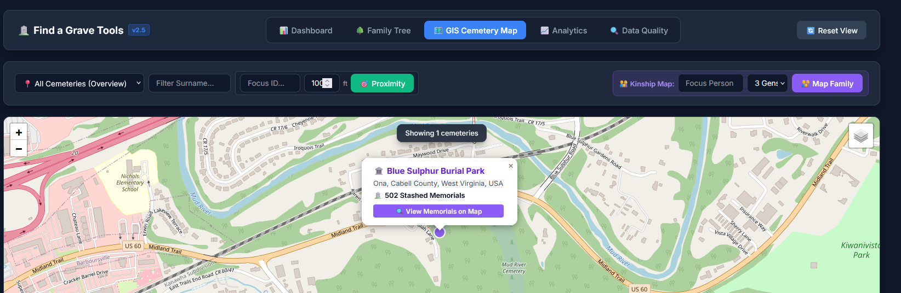
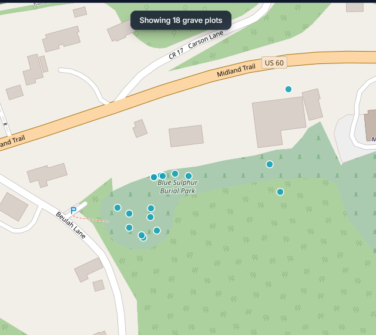

# 📖 Step-by-Step Visual Walkthrough & User Guide

Welcome to the **Find a Grave Genealogy Workstation**! This guide provides a detailed, step-by-step visual tutorial to help you add cemeteries, crawl memorial pages, map family grave plots, and navigate all features of the workstation.

---

## 🧭 Navigation Overview

At the top of your browser window, you will find the main header bar for switching between views:

- **Dashboard** (`/`): Add cemeteries, configure scraper jobs, monitor live logs, and explore database records.
- **Family Tree** (`/tree`): View interactive pedigree charts and export GEDCOM files.
- **GIS Cemetery Map** (`/map`): View cemeteries and grave plots on interactive satellite imagery or OSM map.
- **Analytics** (`/analytics`): View lifespan distributions, timelines, and top surname statistics.
- **Data Quality** (`/quality`): Detect genealogical discrepancies and perform full-text searches.

---

## 🚀 Step 1: Launching the Application

1. Locate the project folder on your computer.
2. Double-click **`run_gui.py`**.
3. A terminal window will start the background database server and automatically launch your browser to `http://127.0.0.1:5050`.

---

## 📊 Step 2: Adding a Cemetery & Crawling Records (Step-by-Step)

### 1. Dashboard Overview

When you open the application, you arrive at the **Cemetery & Memorial Dashboard**.

---

### 2. Enter the Cemetery ID

Find your target cemetery on Find a Grave and copy its numeric ID from the website address (URL). Type the ID into the **Cemetery ID (numeric)** box under **Cemeteries Configuration**.

*(Example: Entering cemetery ID `77797` highlighted in red).*

---

### 3. Add Cemetery & Fetch Metadata / GPS

Click **+ Add Cemetery**. The cemetery will appear in your configuration list with its location, GPS coordinates, and options to fetch location data or scrape records.

*(Example: "Blue Sulphur Burial Park (77797)" auto-populated with coordinates `38.41720, -82.24220`).*

---

### 4. Select Target Cemetery in Job Manager

Under **Active Scraping Job Manager**, click the **Target Cemetery** dropdown menu and select the cemetery you just added.

---

### 5. Configure Relatives & Start Scraping

Choose which family relationship groups you want the crawler to collect (such as _Burial_, _Parents_, _Spouses_, _Children_, _Siblings_, or _Half-Siblings_). When ready, click the green **⚡ Start Scrape** button.

---

### 6. Monitor Live Progress Logs

Watch the live console log panel at the bottom of the Job Manager. It shows real-time progress as burials are discovered, enqueued, and parsed.

Once all the initial memorials are scraped, it will then cycle back to start processing the other selected relationship groups (Parents, Spouses, Children, Siblings, Half-Siblings) for each of the initial memorials. Which then also pulls in any new cemeteries for the relatives that are not in the initial cemetery list. This process will continue until all selected relationship groups are processed for all memorials.

You will see some "Validating" status cemeteries listed on the left side bar. The initial scan will pull in the cemetery IDs but not the cemetery details. These details will need to be added using the **Fetch Missing Cemetery Details** button. This button will pull in the cemetery name, address, and GPS coordinates for all cemeteries that are missing this information. It will cycle through all the "Validating" cemeteries and pull in the cemetery details.

Once completed you will see a list of "Active" cemeteries ready to use. You can now use the **Scrape** function to scrape the memorials for the selected cemetery or cemeteries. The **Scrape** in the cemetery listing will only scrape through relatives stashed from the initial scrape. If you want to also **fully** scrape through the new cemeteries to get all the memorials and all the relatives in that cemetery you will need to use the **⚡ Start Scrape** button in the Job Manager section and select the new cemeteries and the relationship groups you want to scrape through. This process will continue until all selected relationship groups are processed for all memorials.

---

## 🌳 Step 3: Exploring Family Trees (`/tree`)

- Select any individual to center the pedigree network around them.
- Use the **Ancestor Generations** and **Descendant Generations** sliders to expand or collapse how many levels of relatives are displayed.
- Click any box (node) on the screen to instantly refocus the tree on that person.
- Click **Export Pedigree to GEDCOM** to save a standard family tree file.

---

## 🗺️ Step 4: Using the GIS Cemetery Map (`/map`)

- Toggle between **OpenStreetMap** and **Esri World Imagery** satellite aerial view.
- Click purple cemetery pins to view totals and zoom into plot coordinates.

### Grave Plot Markers View

- Type a surname into **Surname Cluster Search** to highlight family plot clusters in gold.
- Use **Geographic Kinship Mapping** to draw color-coded flowlines between a focus person and their buried relatives.

---

## 📈 Step 5: Demographics & Analytics (`/analytics`)

- Analyze age distributions at death, births and deaths by decade, mortality seasonality by month, and top surnames.
- Scope analytics to a specific cemetery or view combined statistics.

---

## 🔍 Step 6: Data Quality & Discrepancy Detection (`/quality`)

- Run the **Discrepancy Detector** to spot chronological errors (e.g., child born before parent, death before birth) or potential duplicates.
- Perform full-text searches across bios and headstone inscriptions with search term highlighting.
